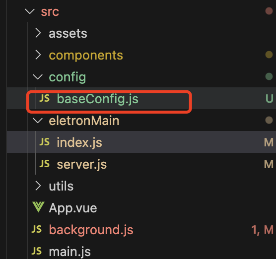

# 爬取视频图片工具

## 免责申明

1. **信息来源声明**：本程序仅用于从相关平台上爬取公开可见的视频图片内容。本程序不对所爬取视频内容的准确性、合法性、完整性或及时性负责。
2. **内容使用声明**：本程序爬取的视频内容仅用于学习、研究或个人娱乐，不得用于任何商业目的。任何因使用本程序爬取的视频内容而产生的法律责任由使用者自行承担。
3. **第三方责任声明**：本程序与相关平台无任何关联，也未获得相关平台的授权。本程序爬取的内容属于第三方平台，使用者在使用过程中需遵守相关平台的相关使用协议及法律法规。

## 文件下载器（支持代理和网址历史记录）

这个 Electron 和 vue3 结合的应用程序允许您从网页获取资源文件（现在支持视频和图片），下载选定的资源文件并支持代理设置，同时维护输入网址的历史记录。应用程序提供了一个用户友好的界面来高效管理这些功能。

## 功能特点

1. **获取资源文件（视频图片）**：监听指定的网页获取所有资源文件。
2. **批量下载资源文件**：允许下载选定的资源文件，并跟踪下载进度。
3. **网址历史记录**：维护输入网址的历史记录，并允许从历史记录中选择。
4. **设置菜单**：提供多种设置选项，包括清除缓存、显示浏览器、自动加载更多内容、自动关闭浏览器和代理设置。
5. **资源文件管理**：在表格中显示资源文件的缩略图、路径、文件名和下载记录，支持文件名重命名和打开下载目录。

## 安装

### 先决条件

- Node.js (>= 18)
- Yarn 或 npm

### 步骤

1. 克隆此仓库
   ```bash
   git clone git@github.com:haipingzi/crawler_client.git
   ```
2. 进入项目目录
   ```bash
   cd <project_directory>
   ```
3. 安装依赖
   ```bash
   yarn install
   ```
   或
   ```bash
   npm install
   ```
   下载依赖有问题的话建议通过 cnpm 下载或者设置网络代理

## 使用

### 修改 Cookie 配置换成自己的



### 运行应用程序

```bash
yarn electron:serve
```

或

```bash
npm run electron:serve
```

### 功能说明

#### 自动登录

1. 通过添加 Cookie

#### 获取资源文件

1. 输入网址。
2. 点击“获取资源”按钮。
3. 所有资源文件将显示在界面中。

#### 单个和批量下载资源文件

1. 选择要下载的资源文件。
2. 点击“下载选中的资源文件”按钮。
3. 总下载进度将显示在顶部，并且显示单个资源文件下载进度。
4. 同时显示单个文件的下载进度
5. 支持下载到指定的目录，支持同一个文件在同一个目录不会覆盖文件名后面加数字自增

#### 网址历史记录

1. 每次输入的网址将自动保存到历史记录中。
2. 下次打开应用时，可以从下拉菜单中选择历史记录中的网址。
3. 默认选择最近使用的网址。
4. 同一个网址爬取的内容进行缓存

#### 设置菜单

在界面右上角的“设置”按钮下，有以下选项：

1. **清除缓存**：清除所有缓存的数据。
2. **显示浏览器**：开启/关闭显示浏览器。
3. **自动加载更多内容**：开启/关闭自动加载更多内容。
4. **自动关闭浏览器**：开启/关闭自动关闭浏览器。
5. **使用代理**：开启/关闭代理功能，并设置代理地址。
6. **选择获取的文件类型**：选择或者取消需要的文件类型。

#### 资源文件管理

在表格中显示和管理资源文件，包含以下功能：

1. **缩略图**：显示资源文件的缩略图。
2. **资源文件路径**：显示资源文件路径，支持点击下载单个资源文件，并显示下载进度。
3. **文件名**：显示文件名，支持双击重命名。
4. **下载记录**：显示下载记录，支持打开文件所在目录。
5. **重命名**：支持对文件名字修改。
